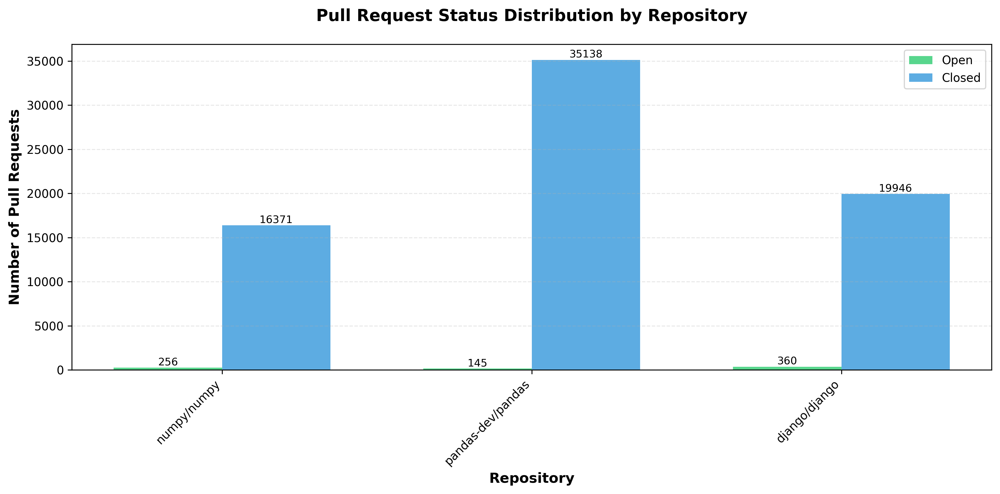
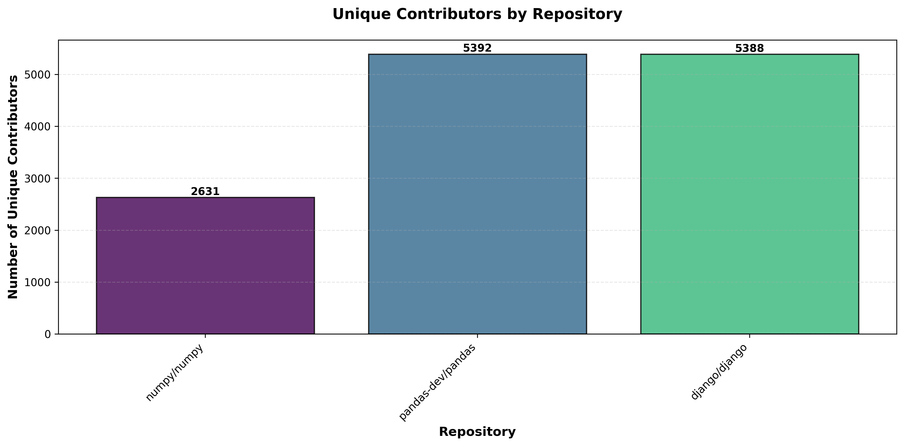
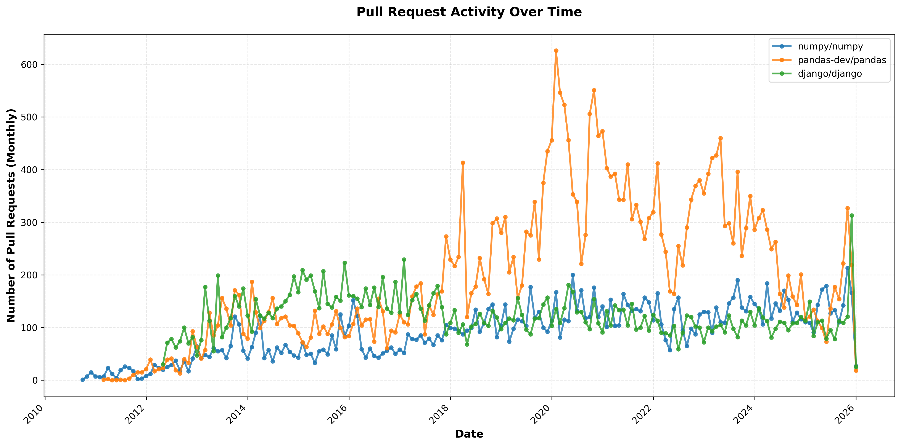
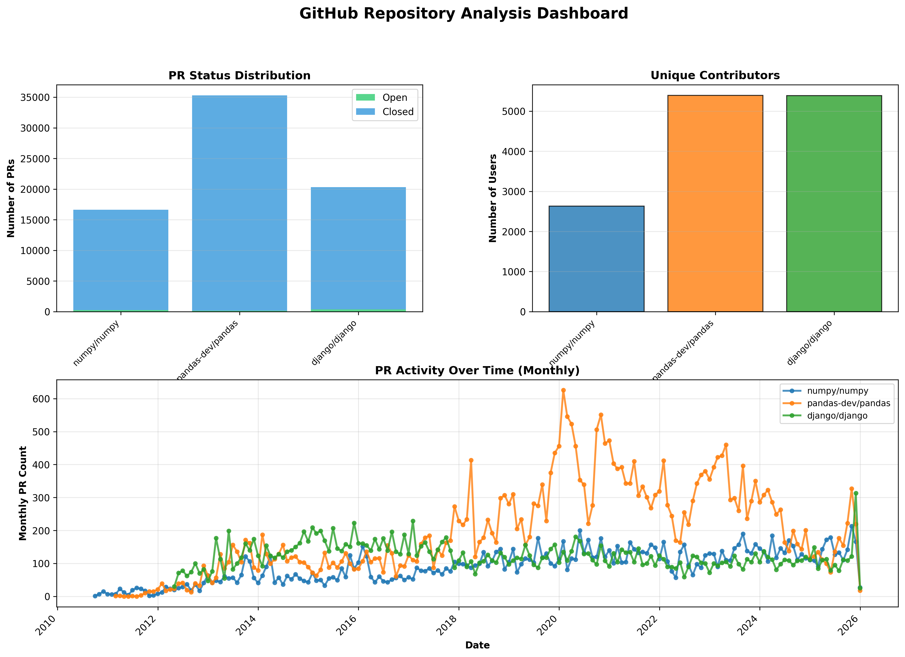

# GitHub Repository Analyzer

A comprehensive Python application for analyzing GitHub repository pull requests using the GitHub REST API. This project collects, analyzes, and visualizes pull request data from multiple repositories, providing insights into repository activity, contributor engagement, and temporal trends.

## Features

- **Data Collection**: Fetches repository metadata, pull requests, and contributor information via GitHub REST API v3
- **Web Scraping**: Extracts additional user profile information using BeautifulSoup
- **Data Persistence**: Stores raw and processed data in pickle format for offline analysis
- **Comprehensive Analysis**: 
  - Pull request status distribution (open vs closed)
  - Unique contributor counts
  - Temporal trend analysis
  - Comparative repository analysis
- **Rich Visualizations**: Multiple chart types using matplotlib
- **Modular Design**: Clean, object-oriented architecture with full type hints
- **Robust Testing**: Comprehensive unit tests with mocking

## Project Structure

```
Final_Project/
├── github_analyzer/          # Main package
│   ├── __init__.py          # Package initialization
│   ├── config.py            # Configuration and authentication
│   ├── github_client.py     # GitHub API client and scraping
│   ├── github_analyzer.py   # Core analyzer class
│   └── visualization.py     # Plotting functions
├── tests/                    # Unit tests
│   ├── __init__.py
│   ├── test_github_client.py
│   └── test_github_analyzer.py
├── main.py                   # Main demonstration script
├── requirements.txt          # Python dependencies
└── README.md                 # This file
```

## Installation

### Prerequisites

- Python 3.10 or higher
- A GitHub Personal Access Token

### Setup Steps

1. **Clone or download this project**

2. **Install dependencies**:
   ```bash
   pip install -r requirements.txt
   ```

3. **Set up your GitHub Personal Access Token**:

   Create a token at: https://github.com/settings/tokens

   Required permissions:
   - `public_repo` (for public repository access)
   - `read:user` (for user profile information)

   Set the token as an environment variable:

   **Linux/macOS (bash/zsh)**:
   ```bash
   export GITHUB_TOKEN='your_token_here'
   ```

   **macOS (fish)**:
   ```fish
   set -x GITHUB_TOKEN 'your_token_here'
   ```

   **Windows (CMD)**:
   ```cmd
   set GITHUB_TOKEN=your_token_here
   ```

   **Windows (PowerShell)**:
   ```powershell
   $env:GITHUB_TOKEN='your_token_here'
   ```

   Alternatively, create a `.env` file in the project root:
   ```
   GITHUB_TOKEN=your_token_here
   ```

## Usage

### Basic Usage

Run the main script with default repositories (numpy, pandas, django):

```bash
python main.py
```

### Custom Repositories

Specify your own repositories as command-line arguments:

```bash
python main.py facebook/react microsoft/vscode torvalds/linux
```

### What the Script Does

The main script demonstrates **two use cases**:

**USE CASE 1: Fresh Data Collection**
1. Connects to GitHub API with your token
2. Collects pull request data for specified repositories
3. Scrapes user profile information
4. Saves all data to `github_data.pkl`
5. Preprocesses and analyzes the data
6. Generates summary statistics and trend analysis
7. Creates visualizations and saves them to `output/` directory

**USE CASE 2: Load from Pickle**
1. Loads previously saved data from pickle file
2. Performs analysis without API calls
3. Generates additional statistics and visualizations
4. Demonstrates reusability of saved data

### Output Files

After running the script, you'll find:

- `github_data.pkl` - Serialized raw and processed data
- `output/` directory containing:
  - `pr_status_distribution.png` - Bar chart of open vs closed PRs
  - `unique_users.png` - Unique contributors per repository
  - `pr_timeline.png` - PR activity over time
  - `comparison_trend.png` - Comparative trend analysis
  - `dashboard.png` - Comprehensive multi-plot dashboard
  - `dashboard_from_pickle.png` - Dashboard from loaded data

## Running Tests

Run the complete test suite:

```bash
pytest
```

Run with verbose output:

```bash
pytest -v
```

Run specific test file:

```bash
pytest tests/test_github_client.py
```

Run with coverage report:

```bash
pytest --cov=github_analyzer --cov-report=html
```

## API Documentation

### GitHubClient

Main class for interacting with GitHub API:

```python
from github_analyzer import GitHubClient
from github_analyzer.config import get_github_token

token = get_github_token()
client = GitHubClient(token)

# Get repository metadata
metadata = client.get_repo_metadata("numpy/numpy")

# Get all pull requests (handles pagination automatically)
prs = client.get_pull_requests("numpy/numpy", state="all")

# Get contributors
contributors = client.get_contributors("numpy/numpy")

# Scrape user profile
html = client.get_user_profile_html("username")
from github_analyzer.github_client import parse_user_profile
profile = parse_user_profile(html)
```

### GitHubRepoAnalyzer

Main analyzer class:

```python
from github_analyzer import GitHubRepoAnalyzer, GitHubClient
from github_analyzer.config import get_github_token

token = get_github_token()
client = GitHubClient(token)
repos = ["numpy/numpy", "pandas-dev/pandas"]

# Create analyzer
analyzer = GitHubRepoAnalyzer(repos, client)

# Collect data from GitHub
analyzer.collect_data(max_users_to_scrape=10)

# Save to pickle
analyzer.to_pickle("data.pkl")

# Load from pickle
analyzer2 = GitHubRepoAnalyzer.from_pickle("data.pkl", client)

# Preprocess data
analyzer.preprocess()

# Compute summaries
summaries = analyzer.compute_summaries()

# Build time series
time_series = analyzer.build_time_series()

# Analyze trends
trends = analyzer.describe_trends(time_series)
print(trends)
```

### Visualization Functions

```python
from github_analyzer import (
    plot_pr_status_distribution,
    plot_unique_users,
    plot_prs_over_time,
    plot_comparison_trend
)

# Plot PR status distribution
plot_pr_status_distribution(summaries, save_path="status.png")

# Plot unique users
plot_unique_users(summaries, save_path="users.png")

# Plot time series
plot_prs_over_time(time_series, save_path="timeline.png")

# Compare specific repos
plot_comparison_trend(time_series, ["repo1", "repo2"], save_path="compare.png")
```

## Analysis Features

### Metrics Computed

For each repository:
- **Open PRs**: Number of pull requests in open state
- **Closed PRs**: Number of pull requests in closed state
- **Unique Users**: Count of unique PR authors
- **Oldest PR Date**: Date of the first pull request
- **Temporal Trends**: PR creation patterns over time
- **Activity Comparison**: Cross-repository activity analysis

### Trend Analysis

The `describe_trends()` method provides:
- Identification of increasing/declining activity
- Comparison of activity levels across repositories
- Temporal patterns and growth metrics
- Statistical correlation analysis

### Visualizations

The project generates multiple visualization types:
1. **Bar Charts**: PR status distribution, unique contributors
2. **Line Charts**: Temporal trends, activity timelines
3. **Multi-plot Dashboards**: Comprehensive overview
4. **Comparative Analysis**: Side-by-side repository comparison

## Error Handling

The application handles common issues:

- **Missing Token**: Clear error message with setup instructions
- **API Rate Limits**: Detects and reports rate limit errors
- **Network Issues**: Graceful handling of connection errors
- **Invalid Repositories**: Informative error messages for non-existent repos
- **Missing Data**: Robust handling of incomplete API responses

## Dependencies

- **requests**: HTTP library for API calls
- **pandas**: Data manipulation and analysis
- **matplotlib**: Plotting and visualization
- **beautifulsoup4**: HTML parsing for web scraping
- **pytest**: Testing framework
- **tabulate**: Pretty table formatting
- **python-dotenv**: Environment variable management
- **responses**: HTTP mocking for tests

## Design Principles

- **Modular Architecture**: Clear separation of concerns
- **Type Hints**: Full type annotations for better IDE support
- **Comprehensive Documentation**: Docstrings for all public APIs
- **Error Resilience**: Robust error handling throughout
- **Testability**: Designed for easy unit testing with mocks
- **Extensibility**: Easy to add new analysis or visualization types

## Troubleshooting

### Rate Limit Issues

If you encounter rate limit errors:
- Authenticated requests allow 5,000 requests/hour
- Wait for the reset time indicated in the error message
- Consider analyzing fewer repositories
- Use pickled data for repeated analysis

### Import Errors

If you get import errors:
```bash
pip install --upgrade -r requirements.txt
```

### Token Issues

Verify your token is set:
```bash
echo $GITHUB_TOKEN  # Linux/macOS
echo %GITHUB_TOKEN% # Windows CMD
```

## Output

The following images show the visualizations generated by the GitHub Repository Analyzer:

### Pull Request Status Distribution


### Unique Contributors Per Repository


### Pull Request Activity Timeline


### Repository Comparison Trends


### Comprehensive Dashboard


### Dashboard from Pickle Data


> **Note**: These images are automatically generated when you run the analyzer. The actual visualizations will depend on the repositories you analyze and the data available at the time of analysis.