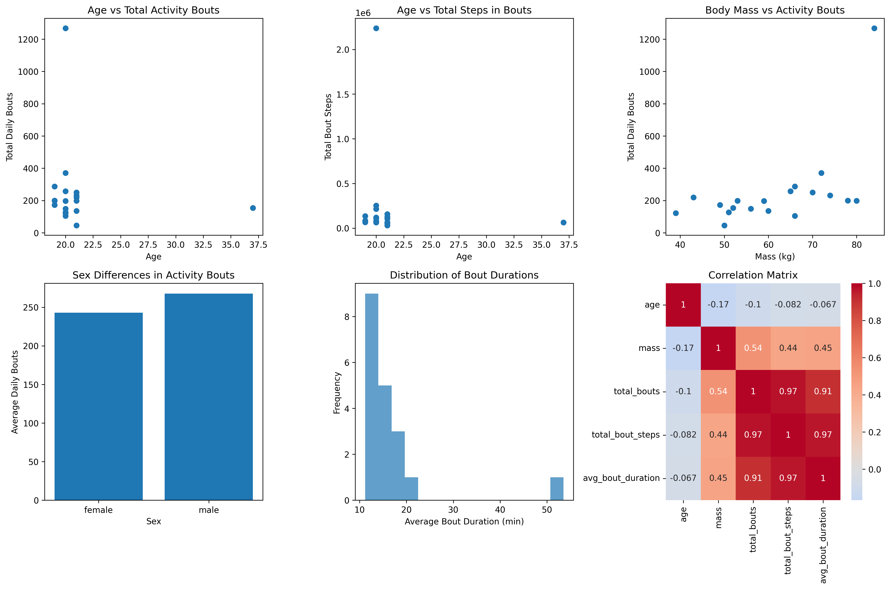
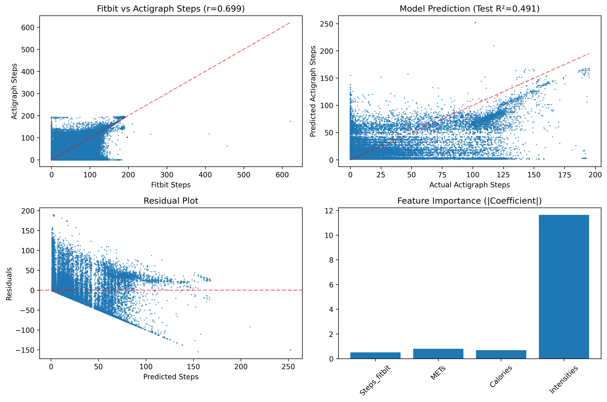
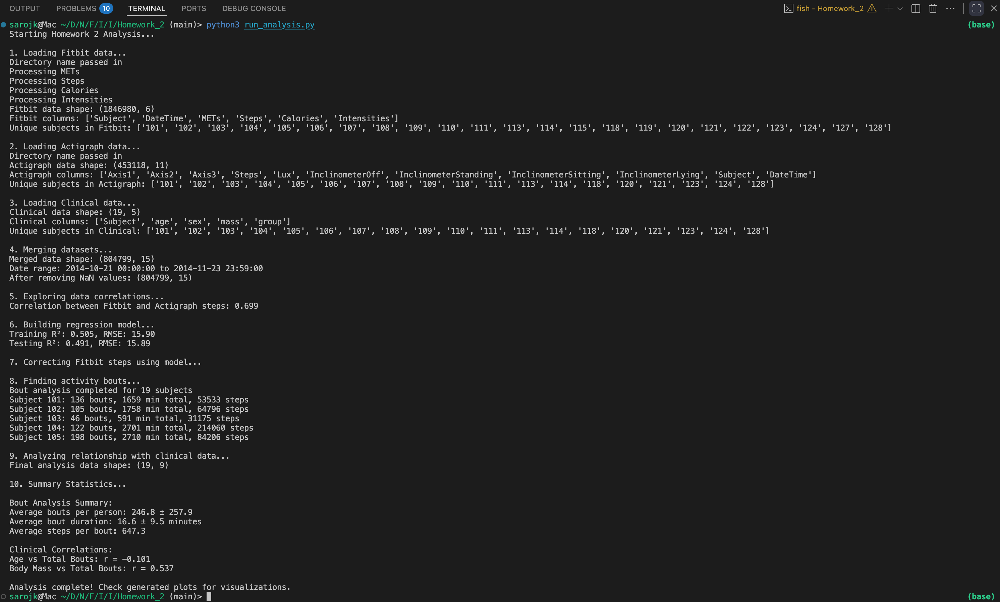
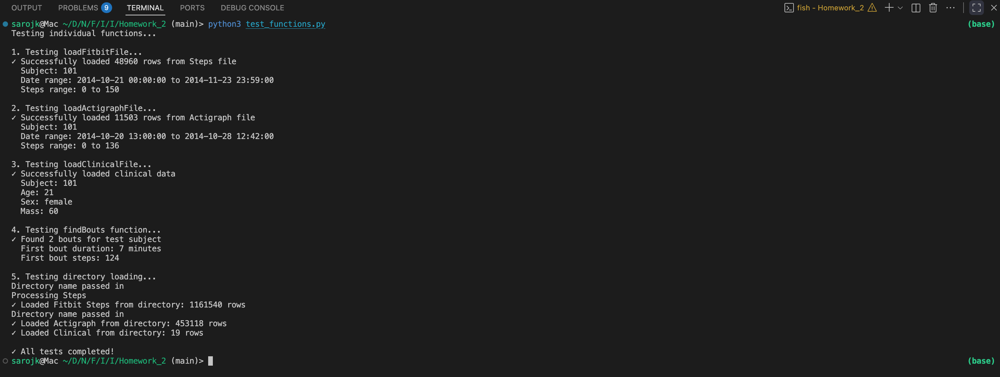

# Homework 2 Analysis Summary

## Overview
This analysis compares wearable device data from Fitbit and Actigraph devices, builds a predictive model, and analyzes activity patterns with clinical data.

## Data Overview
- **Fitbit Data**: 1,846,980 observations from 23 subjects
  - Measurements: Steps, METs, Calories, Intensities
  - Time period: Oct 21 - Nov 23, 2014
  
- **Actigraph Data**: 453,118 observations from 19 subjects  
  - Measurements: 3-axis accelerometry, Steps, Light exposure, Inclinometer data
  
- **Clinical Data**: 19 subjects
  - Variables: age, sex, body mass, group classification

## Key Findings

### 1. Device Correlation
- **Fitbit vs Actigraph Steps correlation: r = 0.699**
- This indicates a strong positive correlation between the two devices
- However, there are systematic differences that warrant correction

### 2. Predictive Model Performance
- **Model**: Linear regression predicting Actigraph steps from Fitbit features
- **Features used**: Fitbit Steps, METs, Calories, Intensities
- **Training R²**: 0.505 (RMSE: 15.90 steps/minute)
- **Testing R²**: 0.491 (RMSE: 15.89 steps/minute)
- The model explains ~50% of variance in Actigraph steps

### 3. Activity Bout Analysis
**Parameters used:**
- Minimum threshold: 10 steps/minute
- Minimum duration: 5 minutes
- Tolerance: 2 minutes of low activity within bouts

**Results:**
- **Average bouts per person**: 246.8 ± 257.9 bouts
- **Average bout duration**: 16.6 ± 9.5 minutes
- **Average steps per bout**: 647.3 steps

### 4. Clinical Relationships
- **Age vs Total Bouts**: r = -0.101 (weak negative correlation)
  - Older individuals tend to have slightly fewer activity bouts
  
- **Body Mass vs Total Bouts**: r = 0.537 (moderate positive correlation)
  - Individuals with higher body mass tend to have more activity bouts
  
## Technical Implementation

### Functions Implemented:

1. **`loadFitbit(path, measures)`**
   - Loads Fitbit data from files or directories
   - Handles multiple measurement types (Steps, METs, Calories, Intensities)
   - Reshapes hourly data with minute columns into long format

2. **`loadActigraph(path)`**
   - Parses Actigraph CSV files with 10-line headers
   - Extracts start date/time from headers
   - Handles multiple accelerometry and inclinometer measurements

3. **`loadClinical(path)`**
   - Parses clinical text files with key-value pairs
   - Converts numeric values appropriately

4. **`findBouts(dataFrame, column, threshold, duration, tolerance)`**
   - Identifies sustained activity periods
   - Allows for brief interruptions within bouts
   - Returns bout DataFrames and durations by subject

### Data Processing Pipeline:
1. Load and merge all data sources on Subject and DateTime
2. Build regression model to predict Actigraph from Fitbit
3. Apply model to "correct" Fitbit step counts
4. Identify activity bouts using corrected steps
5. Analyze relationships with clinical variables

## Generated Visualizations

### 1. Device Comparison Analysis (`fitbit_actigraph_analysis.png`)
- Scatter plot: Fitbit vs Actigraph steps
- Model prediction performance
- Residual analysis
- Feature importance

### 2. Clinical Analysis (`clinical_bout_analysis.png`)
- Age vs activity patterns
- Body mass relationships
- Sex differences in activity
- Bout duration distributions
- Correlation matrix of all variables

## Conclusions

1. **Device Agreement**: Fitbit and Actigraph show good correlation (r=0.70) but systematic differences exist
2. **Model Utility**: The regression model provides reasonable correction (R²=0.49) for Fitbit measurements
3. **Activity Patterns**: Substantial individual variation in bout frequency and duration
4. **Clinical Insights**: Body mass shows stronger association with activity than age
5. **Methodology**: The bout detection algorithm successfully identifies sustained activity periods

## Recommendations for Further Analysis

1. Investigate non-linear relationships between devices
2. Consider time-of-day and day-of-week effects
3. Explore additional clinical variables (e.g., fitness level, health conditions)
4. Validate bout detection parameters with expert knowledge
5. Consider machine learning approaches for device calibration

## Files Generated
- `fitbit_actigraph_analysis.png` - Device comparison and model analysis
- `clinical_bout_analysis.png` - Clinical relationships and activity patterns
- `analysis_summary.md` - This comprehensive summary

## Here are couple of plots which are generated by the script

